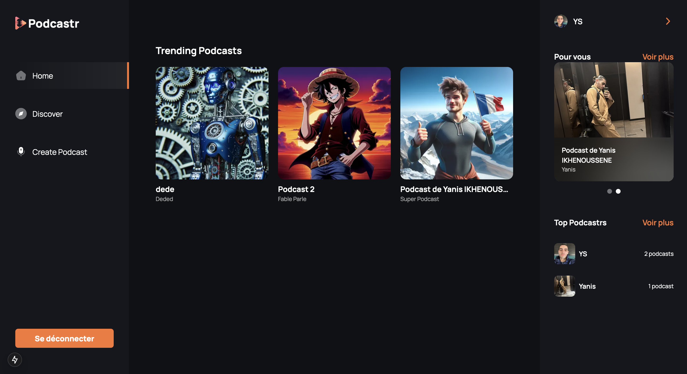
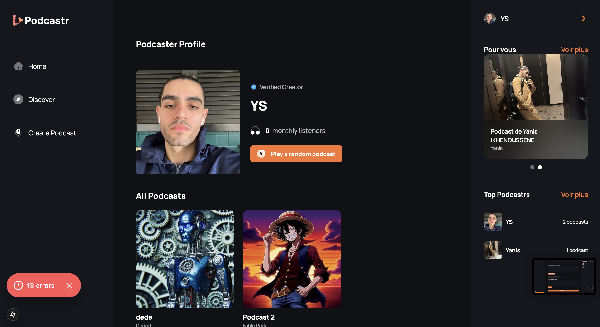
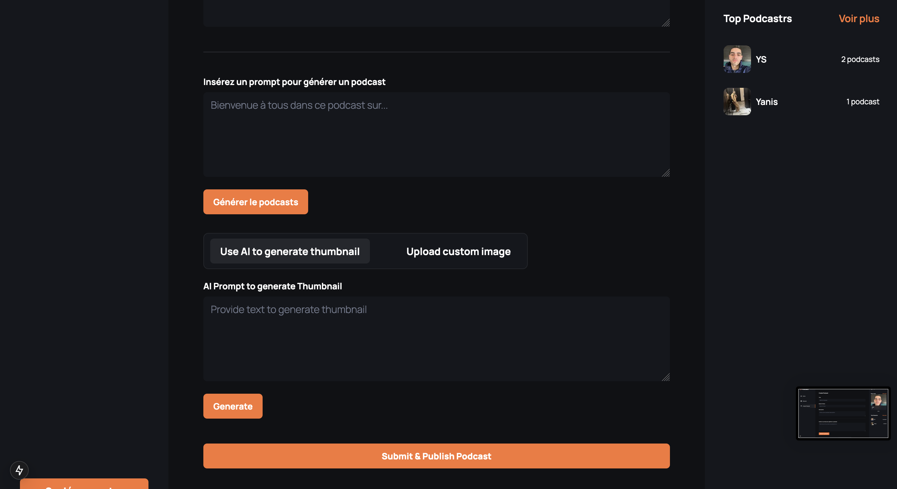
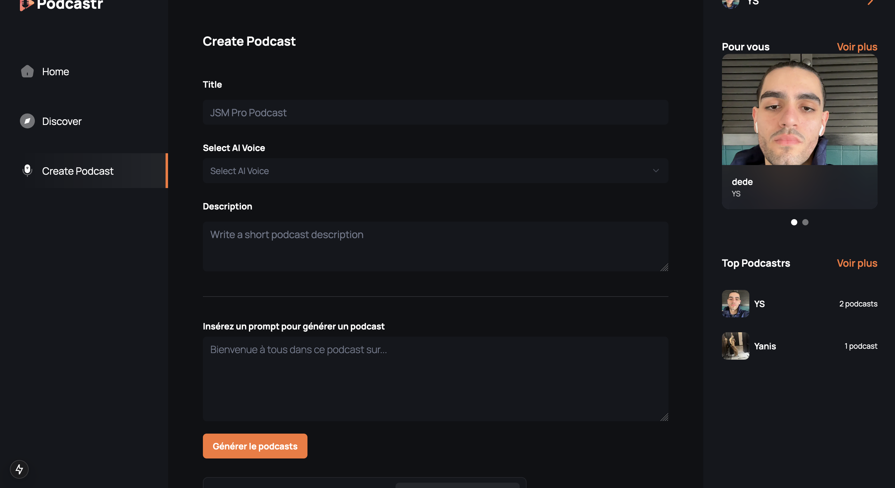
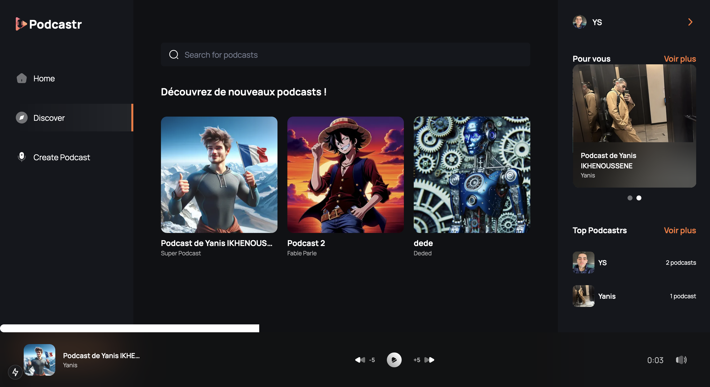
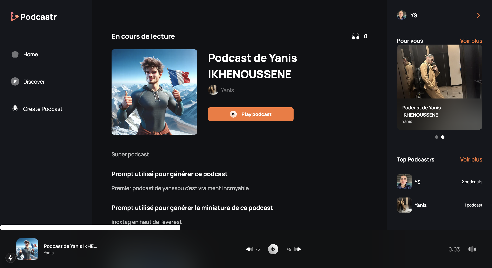

   
    
   

  

    
    
    
    
  

  <h3 align="center">AI Podcast Platform</h3>

## 📋 <a name="table">Table of Contents</a>

1. 🤖 [Introduction](#introduction)
2. ⚙️ [Stack technique](#tech-stack)
3. 🔋 [Fonctionnalités](#features)
4. 💻 [Screens](#screens)

## <a name="introduction">🤖 Introduction</a>

Une plateforme SaaS d'IA de pointe qui permet aux utilisateurs de créer, découvrir et profiter de podcasts avec des fonctionnalités avancées telles que la conversion de texte en audio avec une IA multi-voix, la génération d'images de couverture pour les podcasts et une lecture fluide.

## <a name="tech-stack">⚙️ Stack technique</a>

- Next.js
- TypeScript
- Convex
- OpenAI
- Clerk
- ShadCN
- Tailwind CSS

## <a name="features">🔋 Fonctionnalités</a>

👉 **Authentification Robuste** : Système sécurisé et fiable de connexion et d'inscription des utilisateurs.

👉 **Page d'Accueil Moderne** : Présente les podcasts tendances avec un lecteur audio fixe pour une écoute continue.

👉 **Page Découverte de Podcasts** : Page dédiée pour explorer de nouveaux podcasts populaires.

👉 **Recherche Complète** : Permet aux utilisateurs de trouver des podcasts facilement avec différents critères de recherche.

👉 **Page de Création de Podcast** : Permet de créer des podcasts avec conversion texte-audio, génération d'images par IA et prévisualisations.

👉 **Fonctionnalité IA Multi-Voix** : Prend en charge plusieurs voix générées par IA pour une création de podcast dynamique.

👉 **Page de Profil** : Affiche tous les podcasts créés avec des options pour les supprimer.

👉 **Page Détails du Podcast** : Affiche des informations détaillées sur chaque podcast, y compris les détails du créateur, le nombre d'auditeurs et la transcription.

👉 **Lecteur de Podcast** : Comprend des contrôles de retour/avance, ainsi que les options de coupure/rétablissement du son pour une expérience d'écoute fluide.

👉 **Design Responsive** : Entièrement fonctionnel et visuellement attrayant sur tous les appareils et tailles d'écran.

et bien plus encore, incluant l'architecture du code et sa réutilisabilité.

## <a name="screens">💻 Quelques images</a>

